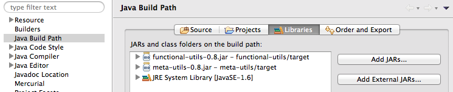
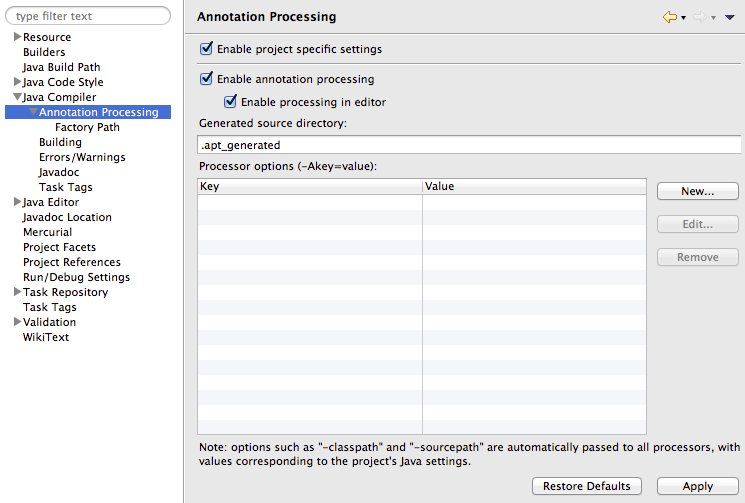
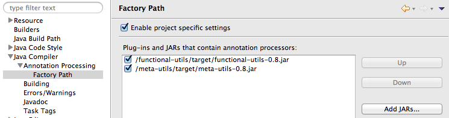

# Annotation processors to enable 1st-class-functions pre-java8

## Motivation

* A static function is basically a function from the arguments to the return value.
* A field is basically a function from the instance to the field value.
* A method is basically a function from the instance and the method arguments to the return value.
* A class constructor is basically a function from the arguments to an instance of that class.

We should be able to use these as if they were regular functions. Java8 finally made this possible, but not completely. This library makes them available also for java6 and java7. You can also use this with java8 if the "standard way" is not enough for you.

## Installing

Put the following files (or the latest versions) to classpath and enable annotation processing in your build tool:

https://github.com/solita/functional-utils/releases/download/0.8/functional-utils-0.8.jar  
https://github.com/solita/meta-utils/releases/download/0.8/meta-utils-0.8.jar

### Eclipse (tested in Juno)

Add the jars to project dependencies:

Project properties -> Java Compiler -> Annotation Processing:
<ul>
  <li>Enable project specific settings</li>
	<li>Enable annotation processing</li>
</ul>

Project properties -> Java Compiler -> Annotation Processing -> Factory Path:
<ul>
	<li>Enable project specific settings</li>
	<li>Add JARs... and select functiona-utils jar</li>
	<li>Add JARs... and select meta-utils jar</li>
</ul>

Now whenever you save a file the metaclasses are automatically generated and immediately ready for use.

### IntelliJ Idea

TODO: Anyone know how Idea supports Annotation Processors?

### Maven/Gradle/...

Please consult the documentation of your build tool on how to enable and control annotation processing.

### Metaclasses for 3rd party libraries?

Since I was able to generate the metaclasses for the standard Java library,
there's a good chance that it will also work for whichever 3rd party library where the source code is available.

Meta-classes for the JDK as well as some 3rd party libraries are included in the release.

## Word of warning

This package comes with no warranty what-so-ever. It's higly experimental, might contain loads of bugs and needs more testing.
Packages and classes may get renamed or moved, and things may suddenly break.
Use at your own risk!

And no, I honestly do not believe that Java is the language of the future. Please use a "real" language if you can.
But if you are stuck in the enterprise world, this project might just make your life worth living.

Bug reports, feature requests and opinionated recommendations are highly welcome ;)

## License

Copyright © Solita Oy

Distributed under the MIT License.
